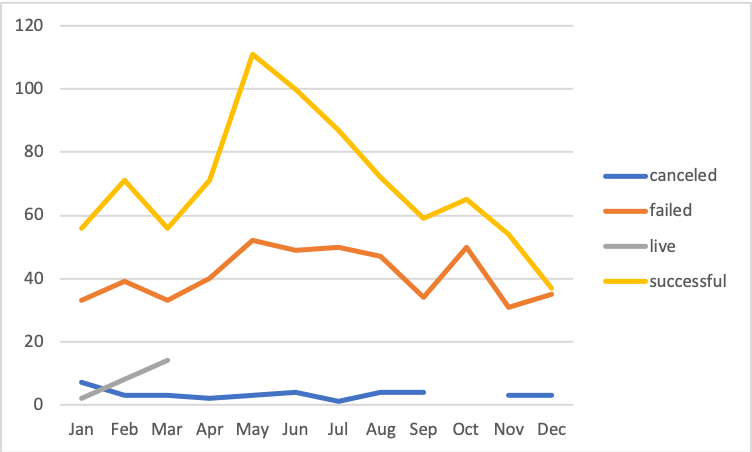

# An Analysis of Kickstarter Campaigns. 
Performing analysis on Kickstarter data to uncover trends.  

As shown in the bar graph below, Theater/Plays was the most successful Category/Subcategory in the US. 

As shown in the line graph below, it appears that May and June were the best times to launch the Theater campaigns however it is not recommended in Decemeber.  

For her to reach her goals, I reccomend that Louise should stick to plays in the US and aim for mid-year as close as possible to May and June. This is peak time for reaping the benefits of campaigning.   

### Challenge

As shown in the Line Graph below, the most successful goal range occured in less than 1000 as well as between 20000 to 24999. The least successful were towards the second half of the graph. For the most failed goal ranges, 25000 to 29999 and 35000 to 39999 were the worst ranges.  

As shown in the PivotChart below, 2013 began the upward trend to successfulness and peaked at 304 in 2015 to eventually decline. There were also a good number of failures in 2015 at 202.   

Based on these observations, it is probably best to proceed with the goals of less than 1000 and aim towards mid-year (second to third quarter) for the most successful return rates. 
